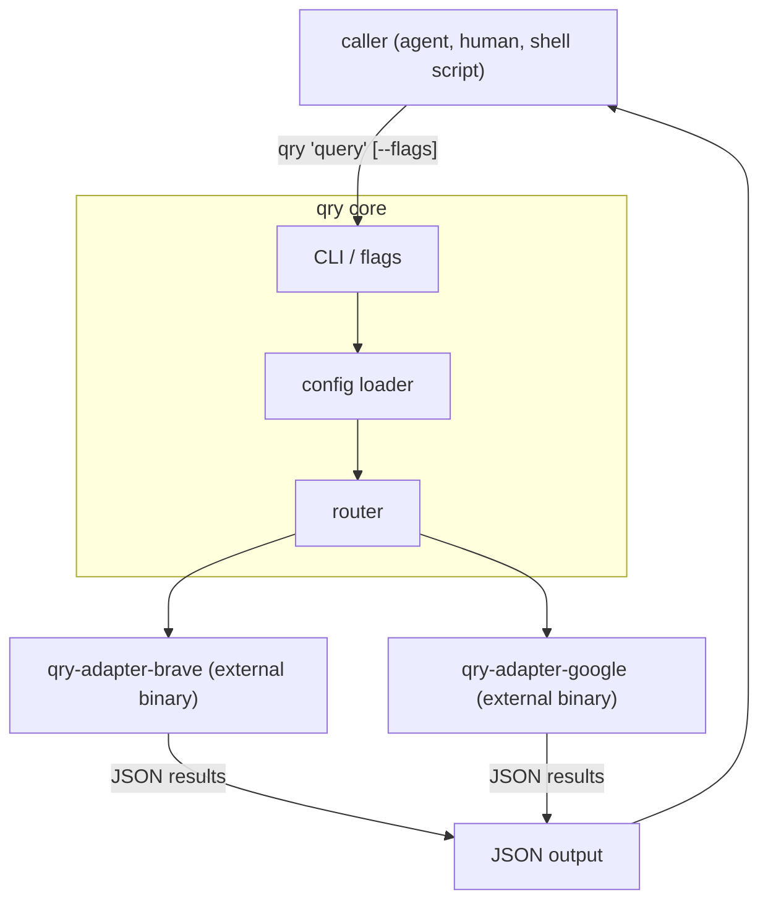
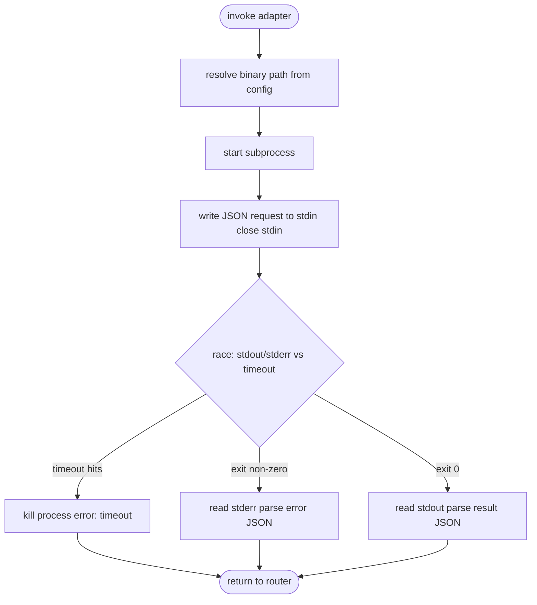
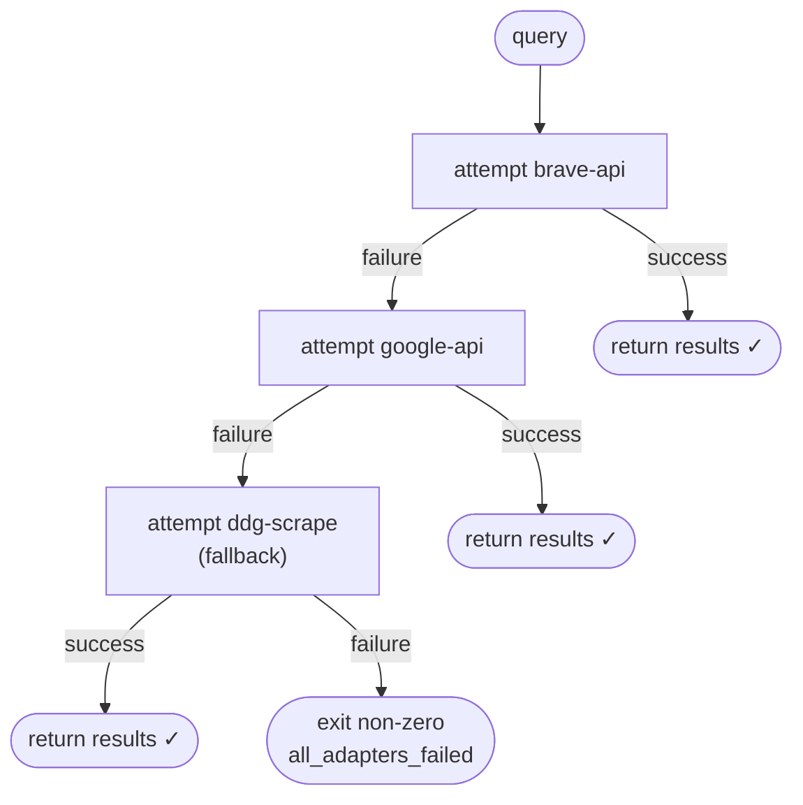
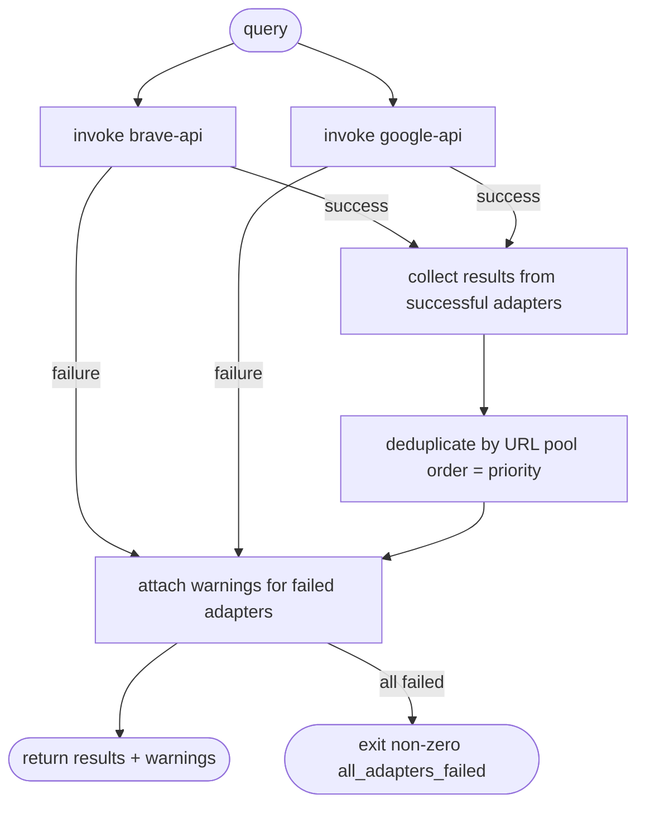
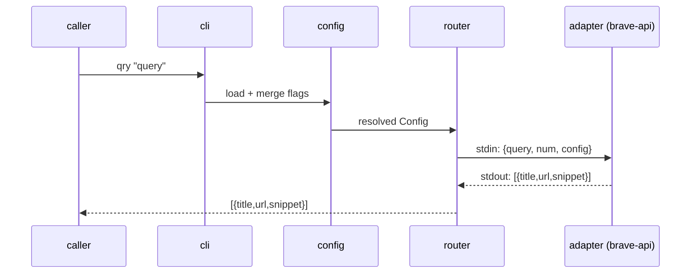
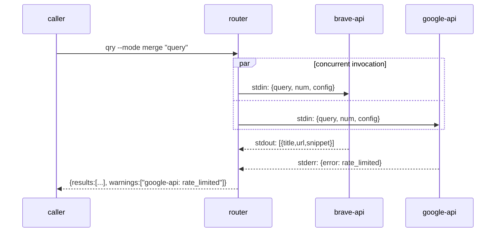

# qry — Architecture

## Overview

`qry` is a CLI search hub. It provides a stable interface for querying the web and delegates
the actual searching to pluggable adapter binaries. The core knows nothing about search engines —
it only knows how to load config, invoke adapters, route between them, and return results.



---

## Components

### 1. CLI layer

Parses flags and arguments. Built with `cobra` + `viper`.

Responsibilities:

- Accept the query string as a positional argument
- Accept flags that override config values for a single invocation
- Pass resolved options down to the router

Key flags:

| Flag        | Overrides          | Description                                 |
| ----------- | ------------------ | ------------------------------------------- |
| `--adapter` | `routing.pool`     | Use a single specific adapter, skip routing |
| `--mode`    | `routing.mode`     | `"first"` or `"merge"`                      |
| `--num`     | `defaults.num`     | Number of results to return                 |
| `--timeout` | `defaults.timeout` | Per-adapter timeout for this invocation     |

### 2. Config loader

Reads `~/.config/qry/config.toml` on every invocation. No daemon, no caching.

Responsibilities:

- Parse and validate the config file
- Resolve adapter binary paths (verify they exist and are executable)
- Merge flag overrides on top of config values
- Expose a resolved `Config` struct to the router

Config is loaded fresh each invocation — no restart needed when config changes. See
[schema.md](./schema.md) for the full config file format.

### 3. Router

The core of `qry`. Implements the two routing modes and owns all adapter invocation logic.

Responsibilities:

- Select which adapters to invoke based on mode and pool config
- Invoke adapters as subprocesses (see [Adapter Invocation](#adapter-invocation))
- Implement `"first"` mode: ordered, stop-at-first-success routing
- Implement `"merge"` mode: concurrent fan-out, deduplication, partial failure handling
- Collect and return final results or a structured error

### 4. Adapters

External binaries. The router invokes them as subprocesses. See [adapters.md](./adapters.md)
for the full contract.

Adapters are completely decoupled from `qry` — they are installed separately, registered in
config, and can be written in any language.

---

## Adapter Invocation



This is the same for both routing modes. The difference is in how the router uses the results.

---

## Routing Modes

### "first" mode



- Adapters are tried **sequentially** in pool order, then fallback order
- First success wins — remaining adapters are not invoked
- Fast: typically only one adapter is invoked per query
- Good for: quick lookups, low-latency use cases, cost-conscious setups

### "merge" mode



- All pool adapters are invoked **concurrently**
- Partial failure is acceptable — results from successful adapters are returned with warnings
- Slower (waits for all adapters) but broader coverage
- Fallback is not used in merge mode
- Good for: research queries, broad coverage, rate-limit distribution

---

## Data Flow

### "first" mode — success



### "merge" mode — partial failure



---

## Project Structure

```
qry/
├── main.go                  # Entry point
├── cmd/
│   └── root.go              # cobra CLI definition, flags
├── internal/
│   ├── config/
│   │   └── config.go        # Config loading and validation
│   ├── router/
│   │   ├── router.go        # Routing logic (first + merge modes)
│   │   └── invoke.go        # Adapter subprocess invocation
│   └── result/
│       └── result.go        # Result and error types, deduplication
├── docs/
│   ├── architecture.md      # This file
│   ├── schema.md            # All JSON schemas and config format
│   └── adapters.md          # Adapter contract and authoring guide
│   └── mvp.md
├── go.mod
└── go.sum
```

---

## Key Design Decisions

**Adapters are subprocesses, not plugins**
Go does not support dynamic linking in a practical way. Subprocesses give us language-agnostic
extensibility with a clean, testable boundary. The stdin/stdout protocol is the API surface.

**Config is read on every invocation**
No daemon means no state to manage and no restart needed when config changes. The overhead of
reading a small TOML file per invocation is negligible.

**`qry` never inspects adapter config**
The `config` block in each adapter's config entry is passed through verbatim as the `config`
field in the request envelope. `qry` does not know or care what keys an adapter needs. This
keeps `qry` decoupled from adapter-specific concerns.

**Partial failure is not an error in merge mode**
In research mode, getting results from 2 of 3 adapters is better than getting nothing. The
caller receives results plus warnings and can decide how to handle incompleteness.

**Output is always JSON**
No interactive mode, no pager, no color. `qry` is designed to be composed with other tools.
Agents pipe it directly; humans pipe it to `jq`.

---

## References

- [schema.md](./schema.md) — all data structures: config, request, response, errors
- [adapters.md](./adapters.md) — adapter contract, protocol, and authoring guide
- [mvp.md](../mvp.md) — product definition, scope, and success criteria
